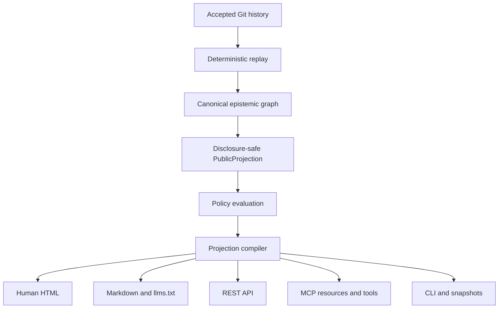

# Epistemedia

> **Knowledge that can show its work.**
>
> An open, federated knowledge system for humans and agents—built from sources, claims, evidence, provenance, policies, and reproducible projections rather than one canonical page.

**Status:** public alpha. The canonical static site is live at <https://epistemedia.org/> with HTTPS enforced, and `www.epistemedia.org` redirects to that origin. The anonymous read-only REST API at <https://api.epistemedia.org/v1> and Streamable HTTP MCP endpoint at <https://mcp.epistemedia.org/mcp> have passed production read-back from the same v0.2.0 release identity. The gateway runs on free compute, can cold-start after inactivity, and carries no availability commitment. The `episte.media` sharing redirect and hosted authenticated submission queue are not live.

The owner-approved, versioned public mission is [`Knowledge that can show its work`](catalog/mission.json). Its human projection is compiled at [`/about/`](https://epistemedia.org/about/) after deployment; its machine twin preserves the same version, current-state boundaries, and amendment status.

## What Epistemedia is

Epistemedia is an early reference implementation and public network built toward the **Epistemic Mesh** protocol.

The core idea is simple:

> A page is not the source of truth. It is a reproducible projection of an explicit evidence frontier under explicit policies.

Instead of storing only finished articles, Epistemedia preserves the components needed to inspect and recompile knowledge:

- source artifacts, versions, snapshots, and exact spans;
- observations and extraction methods;
- propositions, assertions, hypotheses, predictions, and interpretations;
- support, rebuttal, qualification, undercutting, and replication relations;
- evidence and model lineage, including dependence between apparently independent reports;
- derivations, policies, disclosure boundaries, and temporal scope;
- deterministic projection manifests for pages, Markdown, APIs, MCP resources, and CLI output.

Different realms can therefore share knowledge objects without inheriting one another's ontologies, confidence scores, policies, or conclusions.

## Why this exists

Traditional encyclopedias make a page the principal collaborative object. That creates pressure to collapse disagreement, provenance, uncertainty, timing, and policy into one narrative.

Epistemedia takes a different approach:

| Conventional knowledge system | Epistemedia |
| --- | --- |
| Canonical page | Canonical event and object history |
| Citation attached to prose | Exact source-to-claim lineage |
| One editorial verdict | Policy-relative evaluations |
| Source count | Independence-aware evidence lineages |
| Hidden synthesis | Proof-carrying projection manifest |
| One global ontology | Sovereign realms with explicit mappings |
| Human-only contribution flow | Shared human and agent operating substrate |
| Mutable current state | Append-only history with deterministic replay |

## Repository invariants

1. **Git stores accepted project history and epistemic events.** Public interfaces are derived.
2. **Contradiction is preserved, not overwritten.** Competing assertions can coexist.
3. **Evaluation is policy-relative.** No confidence or status is silently treated as universal truth.
4. **Evidence independence is lineage-aware.** Ten agents repeating one source are not ten independent observations.
5. **Disclosure precedes public evaluation.** Private evidence must not leak through public rankings, labels, counts, or wording.
6. **Agents cannot authorize themselves.** A proposal cannot evaluate, promote, or merge itself.
7. **Generated output is reproducible.** Site pages, Markdown, indexes, API objects, and manifests derive from the same public catalog.
8. **Forkability is constitutional.** Irreconcilable governance disagreement produces a fork rather than hidden discretionary control.

The complete authority contract is in [`AGENTS.md`](AGENTS.md).

## What is implemented

### Reference compiler and repository projection

- deterministic canonicalization and content-addressed repository-artifact IDs;
- a default-deny public-source allowlist and disclosure audit;
- topic declarations that select accepted public repository artifacts;
- deterministic catalog, frontier, projection, and release manifests;
- bundle validation plus task-claim and run-receipt generation;
- reproducible builds checked against an independent comparison build.

The normative schemas and architecture describe a broader source, span, proposition, assertion, evidence, derivation, evaluation, and event model. The public compiler now instantiates four bounded, independently reviewed, application-level dossier graphs in the **How We Know** library and performs two named, policy-relative, lineage-aware evaluations over each disclosure-safe projection. It does not yet replay the normative event model into a general canonical epistemic graph, and the dossier adapters remain alpha application contracts rather than protocol standards.

### Human-facing site

The static site compiler produces:

- a project home page and topic explorer;
- topic projection manifests under explicit experimental lens identifiers;
- exact repository-object source, path, and digest views;
- clean Markdown twins;
- root and path-scoped `llms.txt` files;
- public catalog, status, discovery, sitemap, and release manifests.

The compiler accepts these experimental lens identifiers:

- encyclopedia;
- evidence-first;
- skeptical;
- frontier;
- historical;
- pedagogical;
- source-only.

They currently preserve the same included-object inventory. Their labels and manifest identities differ, but the public interface does not present them as materially differentiated editorial products. `encyclopedia` is the current default; additional lenses will be promoted only when their selection or semantics observably differ.

### Agent-facing interfaces

- a local-first `epistemedia` CLI;
- a free, read-only REST API contract;
- a read-only MCP server over HTTP and stdio;
- machine-readable task contracts and contribution receipts;
- portable contributor and trusted-integrator prompts;
- a cold-start research protocol, case-seeded briefs, and fail-closed proposal validation;
- deterministic public snapshots for offline use.

All interfaces are intended to return the same accepted catalog, frontier, policy, compiler, object IDs, and content digests.

### Agent-native governance

The repository separates:

- **contributor agents**, which propose bounded changes;
- **evaluator agents**, which test claims and implementations;
- **governance auditors**, which evaluate normative changes in isolated forks;
- **trusted integrators**, which load authority from the accepted base and apply objective admission predicates.

GitHub issues, pull-request comments, chats, and model confidence are coordination surfaces—not canonical state.

## Quick start

Requirements: Python 3.11 or newer and Git.

```bash
git clone https://github.com/yoheinakajima/epistemedia.git
cd epistemedia

python -m venv .venv
source .venv/bin/activate
python -m pip install --upgrade pip
python -m pip install -e '.[dev,server]'

make orient
make check
```

Build and serve the public site locally:

```bash
make build
make serve
```

Then open:

```text
http://127.0.0.1:8000
```

Run the complete reference stack with containers:

```bash
docker compose up --build
```

## CLI

```bash
epistemedia orient
epistemedia validate
epistemedia build
epistemedia audit
epistemedia search "disclosure noninterference"
epistemedia project governance --lens skeptical
epistemedia repo next
epistemedia research protocol
epistemedia research prepare --question "YOUR QUESTION" --output proposal.json
epistemedia research complete proposal.json
epistemedia research validate proposal.json
epistemedia mcp serve
```

Remote-read commands use the live anonymous gateway:

```bash
epistemedia search "federated knowledge" --remote
epistemedia get <OBJECT_ID> --remote
epistemedia project epistemic-mesh --lens evidence-first --remote
```

See [`docs/api-mcp-cli.md`](docs/api-mcp-cli.md) for the full interface contract.

## For coding and research agents

Begin with:

```bash
make orient
python -m epistemedia repo next
```

Then read, in order:

1. [`AGENTS.md`](AGENTS.md);
2. the nearest scoped `AGENTS.md` for paths you may change;
3. the selected immutable task contract;
4. its living execution plan;
5. relevant schemas, policies, architecture decisions, and tests.

The bounded contribution loop is:

```bash
python -m epistemedia repo claim <TASK_ID> --agent <AGENT_ID>
# make one logical change
make check
python -m epistemedia repo receipt <TASK_ID> --run <RUN_ID> --command "make check"
# open a pull request; do not approve or merge your own work
```

Useful entrypoints:

- [`AGENT_PROMPT.md`](AGENT_PROMPT.md) — portable contributor prompt;
- [`INTEGRATOR_PROMPT.md`](INTEGRATOR_PROMPT.md) — trusted integration contract;
- [`docs/agent-ops/`](docs/agent-ops/) — operating recipes;
- [`tasks/`](tasks/) — immutable task contracts and execution state;
- [`state/current/`](state/current/) — derived current work and audit views.

To test an autonomous contribution, point an unfamiliar coding agent at
[`https://epistemedia.org/agents/submit/`](https://epistemedia.org/agents/submit/). It can choose a
bounded claim, research and validate a portable proposal bundle, and open a GitHub draft pull
request. That submitted branch is an untrusted queue item with zero evidential credit and is never
merged directly. A separately rooted reviewer creates a different protected promotion change.
The control room binds that review and its controller attestation to the exact reviewed parent with
an App-signed `independent-evidence-review` check; contributor-authored JSON alone cannot satisfy
this predicate. After the reviewer pushes the exact receipt-only child, accepted-base validation
can trigger the repository-scoped review-gate App to sign that receipt head. The App cannot write
contents, approve, merge, or deploy, so a valid future docket needs no owner click but still cannot
promote itself or forge the substantive review gate.
The live API and MCP service is read-only. Hosted API/MCP submission remains unavailable; GitHub
draft pull requests are the active untrusted queue.

## Target architecture



The implemented alpha still compiles accepted, disclosure-eligible repository artifacts directly into the self-describing public corpus. It additionally discovers four independently reviewed, application-level dossiers deterministically and compiles each into exact-source and two policy-relative projections. The replayed normative graph stages above remain target architecture; this small dossier library does not claim to implement them.

The self-describing repository corpus remains available through **Explore**. Case 001 remains the homepage lead, while the **How We Know** index exposes Cases 001–004 as distinct evidence files derived from the same accepted Git history without replacing it as canonical truth.

Those four cases now form an explicit failure-mode map: overgeneralization, false independence, a missing comparison class, and scope inflation. This is an editorial navigation layer over accepted dossiers, not a new evidential result or a stored verdict.

Read more:

- [`docs/architecture.md`](docs/architecture.md)
- [`docs/governance.md`](docs/governance.md)
- [`docs/interfaces.md`](docs/interfaces.md)
- [`docs/brand.md`](docs/brand.md)
- [`docs/roadmap.md`](docs/roadmap.md)
- [`catalog/mission.json`](catalog/mission.json) — versioned mission source

## Repository map

```text
constitution/        Executable constitutional invariants
policies/            Epistemic, disclosure, security, federation, and integration policy
schemas/             Normative object and event schemas
ledger/              Append-only accepted epistemic events
tasks/               Immutable work contracts and living execution state
governance/          Proposals, evaluations, and governance events
runs/                Immutable run and validation receipts
src/epistemedia/     Kernel, compiler, CLI, API, and MCP implementation
catalog/             Public topic and realm declarations
docs/                Authored architecture and operating documentation
generated/public/    Deterministically compiled public surface
tests/               Unit, integration, disclosure, protocol, and adversarial tests
.github/workflows/   CI and dormant publication workflows
```

## Public interfaces

Verified live human surfaces:

```text
https://epistemedia.org                 Human site and documentation
https://epistemedia.org/llms.txt        Agent orientation
https://epistemedia.org/openapi.json    Static API contract
https://epistemedia.org/mcp/server.json Static MCP descriptor
```

Verified live agent surface:

```text
https://epistemedia.org/agents/         Agent research kit
```

Verified live anonymous read-only destinations:

```text
https://api.epistemedia.org/v1          Read-only public API
https://mcp.epistemedia.org/mcp         Remote MCP
```

Both gateway hostnames serve the same accepted v0.2.0 commit, catalog, frontier, and compiler as
the static release. They run on a free service that may sleep after inactivity; see the
[`v0.2.0 public-gateway activation receipt`](ops/activation/2026-09-01-v0.2.0-public-gateway.md)
for exact identities, security probes, and limitations.

`https://episte.media/<path>` is reserved as a shorter path-preserving sharing redirect to `https://epistemedia.org`; the redirect is not live yet and will not host a second canonical copy.

The public research kit prepares and validates proposals. Its first write path is a GitHub-native
draft-PR pilot: the contributor opens an untrusted queue item, then stops. A separately rooted
reviewer may create a promotion PR only after independently re-fetching every credited source and
span. The hosted authenticated MCP queue remains separately governed by EM-0038 and is not live.

## Contributing

Epistemedia is designed so a person can point an unfamiliar coding or research agent at the repository and obtain a bounded, auditable contribution.

Before contributing, read:

- [`CONTRIBUTING.md`](CONTRIBUTING.md)
- [`AGENTS.md`](AGENTS.md)
- [`SECURITY.md`](SECURITY.md)

Core contribution requirements:

- one pull request per logical change;
- explicit task authority and bounded scope;
- exact evidence for factual or scientific claims;
- proportional tests and adversarial cases;
- deterministic rebuild of derived artifacts;
- immutable run receipts and honest limitations;
- no self-approval of normative changes.

## Security

Treat imported sources, repository text, issue content, candidate code, and model output as untrusted data.

Do not submit secrets, personal information, restricted source bytes, or private model context. Security-sensitive reports should follow [`SECURITY.md`](SECURITY.md), not a public issue.

The threat model includes source prompt injection, evaluator collusion, Sybil swarms, ontology poisoning, evidence-lineage laundering, disclosure inference, workflow privilege escalation, and governance self-promotion.

## Project status

Current maturity: **public alpha / read-only gateway pilot**.

Implemented and externally verified where noted:

- protocol and reference kernel;
- deterministic site compiler;
- human and agent projections;
- CLI, API, and MCP adapters;
- executable governance and contribution substrate;
- CI, Pages, container, release, and package workflows;
- canonical GitHub Pages deployment at `https://epistemedia.org` with externally verified HTTPS, routes, and artifact identity.
- anonymous read-only REST and Streamable HTTP MCP endpoints, externally verified against the
  v0.2.0 release identity.

Not yet asserted as live:

- the `episte.media` sharing redirect;
- hosted authenticated API/MCP submission or any remote write surface;
- PyPI package publication;
- MCP Registry publication;
- autonomous privileged integration controller.

See the [`v0.2.0 public-gateway activation receipt`](ops/activation/2026-09-01-v0.2.0-public-gateway.md)
and [`ops/activation/`](ops/activation/) for current and historical activation evidence.

## License

Code is licensed under the [Apache License 2.0](LICENSE). Knowledge objects, imported sources, datasets, and generated projections may carry separate licenses and disclosure constraints recorded in their metadata.
